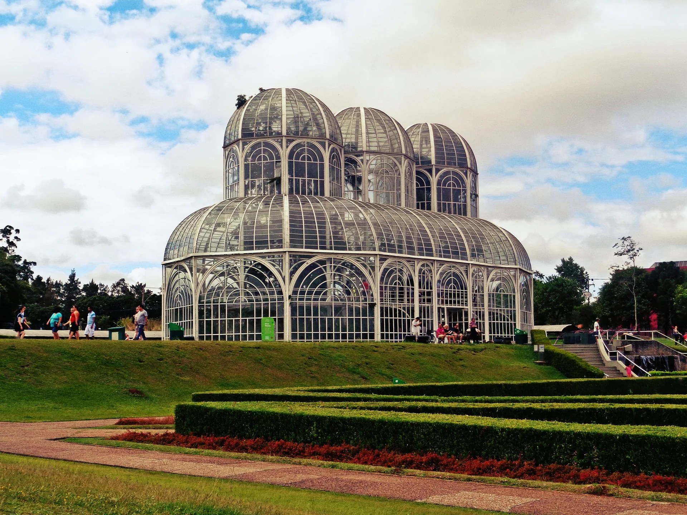

# Curitiba (CWB)

A Subway Builder map of Greater Curitiba, Paraná, Brazil.



**Status: pack builds and validates with zero blockers.** Not yet published or played.

```
python3 ../tools/check_map_pack.py CWB.zip --tag 1.0.0
→ 0 blocker(s), 3 other finding(s)
```

## Why Curitiba

Curitiba is the city that chose BRT *instead of* a metro. Its 1974 *eixos estruturais* — bus
corridors with dedicated lanes, tube stations and pre-paid boarding — became the model copied
by Bogotá, Istanbul and Jakarta, and are the reason the city never laid rail. The 2022 census
records how that turned out for Curitiba's 716,001 out-of-home commuters:

| Main mode to work | Share |
| --- | --- |
| Car | 49.8% |
| Bus | 26.5% |
| On foot | 10.9% |
| Motorcycle | 4.9% |
| Bicycle | 2.7% |
| BRT | 0.4% |
| **Train or metro** | **0.0%** |

A quarter of the city commutes by bus and exactly none by rail. "Build the metro Curitiba
never built" is not a reskin of an existing network — it is the actual counterfactual, against
a surface system already carrying the load.

It is also a whole empty country on the map: the registry lists **272 maps and none for
Brazil** (9 Peru, 1 Argentina, nothing else in South America).

## What got built

| File | Size | Contents |
| --- | --- | --- |
| `demand_data.json` | 11.4 MB | 19,659 demand points, 64,354 pops, 2,037,039 modelled trips |
| `special_demand_points.json` | 0.2 MB | 57 named places for the Special Demand mod |
| `buildings_index.bin` | 148 MB | 1,016,715 buildings with heights, 1,352,835 cell refs |
| `buildings_index.json` | 256 MB | same, legacy form for game ≤1.3.0 |
| `CWB.pmtiles` | 70 MB | 8 layers, z4–15 |
| `roads.geojson` | 27 MB | 59,132 ways (1,736 highway / 3,624 major / 53,772 minor) |
| `runways_taxiways.geojson` | 0.1 MB | 151 polygons — Afonso Pena and Bacacheri |
| `config.json` | 1 KB | — |
| **`CWB.zip`** | **210 MB** | for comparison: Amsterdam 226 MB, Cairo 386 MB |

Tile layers: `water`, `buildings`, `landuse` (park + aerodrome), `commercial` (with the 1.5
college distinction), `industrial`, `city_labels`, `suburb_labels`, `neighborhood_labels`.

## Data provenance

Demand is built entirely from government sources — no OSM population estimation. Full method
in [../docs/09-brazil-data-sources.md](../docs/09-brazil-data-sources.md).

| Layer | Source | Result |
| --- | --- | --- |
| Residents | IBGE Censo 2022, census tracts | 5,623 tracts, 3,271,037 people |
| Distribution | IBGE CNEFE 2022 addresses | 1,388,241 dwelling units placed — **99.90% of the census household count** |
| Jobs | IBGE CEMPRE 2024 + CNEFE establishments | 148,690 job sites, 17 municipal control totals |
| Commute calibration | IBGE Censo 2022 table 10330 (car mode) | χ² 0.0071 against observed time bands |
| Schools | INEP Censo Escolar 2024 | 2,051 active schools, 680,403 enrolments, 79% geocoded to a CNEFE education address |
| Zoning, bairros, parks, water | IPPUC (SIRGAS-2000) | 223 zoning polygons, 75 official bairros |
| Buildings, roads | Overture 2026-07-22.0, OSM | Overture has **15× more footprints than OSM** here |

Target classification: `high-data-quality` + `high-detail` under the registry's
[rubric](../docs/06-railyard-and-registry.md).

Curitiba runs a net **job deficit against its own population** — 1.26 M formal jobs to 1.77 M
residents — and pulls commuters in from the metropolitan ring, where 5.6% of Curitiba's own
residents also travel out to work.

## Extent

`bbox = [-49.55, -25.72, -48.95, -25.15]` — 60 × 63 km, 3,797 km², 17 municipalities,
**96.7% of IBGE's Curitiba *concentração urbana***. Chosen over three alternatives; see
[BUILD-PLAN.md](BUILD-PLAN.md).

Resident-weighted nearest-neighbour spacing p50 **0.244 km** at 18,126 commute points — tighter
than the shipped Sydney map's 0.295 km at 9,687 points.

## Special demand

57 named places, drawn from their surrounding catchment with the same fitted deterrence
function as commuting, and routed through OSRM:

| Type | Count | Notes |
| --- | --- | --- |
| University campuses | 18 | UFPR split across its 5 campuses, PUCPR, UTFPR, Positivo, Tuiuti, … |
| Shopping centres | 10 | Palladium, Barigüi, Mueller, Estação, Jockey Plaza, Pátio Batel, … |
| Hospitals | 10 | HC-UFPR (the largest public hospital in Paraná), Pequeno Príncipe, Erasto Gaertner, … |
| Parks | 7 | Barigui, Jardim Botânico, Tanguá, Tingui, Bosque Alemão, … |
| Stadiums | 4 | Arena da Baixada 42,000; Couto Pereira 37,000; Vila Capanema 17,000 |
| Airports | 2 | Afonso Pena, Bacacheri |
| Culture, zoo, industry, military | 6 | Ópera de Arame, MON, Teatro Guaíra, zoo, REPAR refinery, CINDACTA II |

**BRT terminals are deliberately excluded.** Curitiba's 24 URBS terminals are the obvious
candidates and they are wrong for two reasons. A terminal is not a trip *end* — people pass
through it on the way somewhere else, and that journey's demand is already represented by the
home and workplace at either end, so adding the terminal would count it twice. And the map is
greenfield: the premise is the metro Curitiba never built, so baking the existing BRT network's
interchange points into the demand surface would pre-commit the player to the corridors URBS
already chose. The same reasoning excludes bus stations and park-and-ride. It does not exclude
the airport, which is a genuine origin and destination in its own right.

### Schools

Commuting is a minority of urban travel — Sydney's household travel survey puts journey-to-work
at 14.8% of journeys — so a map built only from a journey-to-work matrix under-represents exactly
the destinations a player wants to serve. Education is the largest category official data can
supply in bulk rather than by hand-curation.

INEP's **Censo Escolar 2024** gives real per-school enrolment by level for 2,051 active schools
in the extent (680,403 enrolments). It carries no coordinates, but it does carry each school's
postcode, and CNEFE has coordinates for every address plus a species code flagging education
establishments — so schools are placed by joining on CEP, preferring an address CNEFE already
records as a school. 1,630 of 2,051 (79%) matched that way, 389 via any address at the same
postcode, 106 unmatched. Schools sharing a postcode are merged, giving 1,476 sites.

Travel fractions by level, because a six-year-old does not travel independently:

| Level | Ages | Fraction |
| --- | --- | --- |
| Infantil | 0–5 | 0.20 |
| Fundamental — anos iniciais | 6–10 | 0.35 |
| Fundamental — anos finais | 11–14 | 0.60 |
| Médio | 15–17 | 0.85 |

The 0.35 and 0.85 anchors come from the Sydney build's reading of the NSW household travel
survey; the middle two interpolate. They are assumptions, not measurements.

### Trip-purpose mix

| Purpose | Trips | Share |
| --- | --- | --- |
| Commute | 1,316,245 | 64.6% |
| Special destinations | 408,400 | 20.0% |
| Education | 312,394 | 15.3% |

35.4% of modelled trips are non-commute. The Sydney build reached 32% from entirely independent
sources. Both are still commute-heavy against a real purpose split — if IPPUC's origin–destination
survey or ANTP's mobility series publishes a purpose breakdown for Curitiba, that is the number
to calibrate against.

Adding special demand and schools raises `sum(points[].residents)` from 1,316,245 to 2,037,039, because
every added trip needs an origin and the schema requires residents to equal the pop total. That
is correct: a student or a match-goer is not a census commuter. `config.json`'s `population`
still reports the true census figure of 3,271,037, so the registry's mismatch warning is
expected.

## Calibration

The gravity model's deterrence function *and* travel-time model are fitted jointly to the
observed car-commute time distribution, rather than assumed:

```
alpha 0.80   beta 0.040   floor 5.0 min   terminal 1.0 min   v_max 32 km/h   χ² 0.0071
```

| Commute band | Modelled | Observed |
| --- | --- | --- |
| ≤ 5 min | 4.83% | 6.25% |
| 6–15 min | 26.82% | 26.30% |
| 15–30 min | 35.30% | 38.91% |
| 30–60 min | 28.53% | 23.67% |
| 1–2 h | 4.49% | 4.87% |
| 2–4 h | 0.03% | 0.01% |

All 46,709 distinct point pairs were routed through OSRM with zero failures. Final
size-weighted mean commute **14.9 min / 11.22 km**, median 9.33 km (Dubai ships 14.2 min /
9.7 km).

## Running the pipeline

```bash
python3 -m venv .venv && .venv/bin/pip install certifi shapely numpy duckdb
brew install tippecanoe pmtiles osmium-tool && npm install -g mapshaper
# Docker required for OSRM

.venv/bin/python src/step1_fetch.py        # census, CNEFE ×17, CEMPRE, commute tables, IPPUC
.venv/bin/python src/step2_residents.py    # tract population → dwelling addresses
.venv/bin/python src/step3_jobs.py         # CEMPRE totals → establishment addresses
.venv/bin/python src/step4_points.py       # → 18,126 demand points
.venv/bin/python src/step5_pairing.py      # calibrated gravity model
.venv/bin/python src/step6_routing.py --start-osrm   # OSRM → demand_data.json
.venv/bin/python src/step7b_overture.py    # Overture footprints
.venv/bin/python src/step7_geodata.py      # roads, runways, buildings index
.venv/bin/python src/step8_config.py       # config.json
.venv/bin/python src/step9_tiles.py        # CWB.pmtiles
.venv/bin/python src/step10_special.py     # 57 special-demand places, re-routed
.venv/bin/python src/step11_schools.py     # 1,476 school sites from INEP enrolment
.venv/bin/python src/step8_config.py       # rewrite config.json with the final totals
```

Steps 10 and 11 mutate `out/demand_data.json` in place and refuse to run twice, so re-run step 6
first if you need to rebuild them.

Every step is idempotent and caches its downloads. `src/analyse_spacing.py` reports the
spacing statistics the registry scores.

`OSRM_PORT` defaults to 5001 — port 5000 is taken by ControlCenter (AirPlay Receiver) on
macOS, and Docker reports that as a bare exit 125.

## Known gaps

- **No `ocean_foundations`.** Curitiba is inland, so there is no coast to shade. The Passaúna
  and Iraí reservoirs are large enough that unrestricted tunnelling under them is worth a look.
- **No `drivingPath`.** Measured, not guessed: a median 14 km route is 370 coordinates and 8.8 KB
  of JSON, so paths for all 53,918 pops would add **≈474 MB** to a 9.6 MB file and more than
  double the pack. `src/step6_routing.py --driving-path` will generate them if you want to trade
  the size for a road-following line in the pop-details panel.
- **OSRM is ~1.8× optimistic.** The census-implied mean car commute is ≈26 min; OSRM gives
  14.9 min for the same pairs. Part congestion, part door-to-door versus road-only. Shipping
  OSRM values matches what other maps do, but it models driving as faster than reality and so
  biases mode choice against transit.
- **Heights are mostly defaults.** Only 0.1% of Overture's footprints here carry a height;
  2,746 borrowed one from an overlapping OSM building, the rest default to 3.2 m.
- **Special-demand capacities are estimates.** Locations are factual (OpenStreetMap) and stadium
  seating is published, but visitor and enrolment figures are class-based estimates by the
  author, marked `estimate` in `src/special_places.py`. They are tuning parameters, not claims.
  Anyone with real INEP enrolment or Infraero passenger figures should replace them.
- **Tiles extend past the bbox** by the 0.25° OSRM trim margin, which inflates the archive
  slightly.

## Attribution

Cover photo: Jardim Botânico de Curitiba by [jerzykwpodrozy](https://pixabay.com/users/jerzykwpodrozy-16143839/)
via Pixabay (Pixabay Content License).

IBGE (Censo Demográfico 2022 — Agregados por Setores Censitários, CNEFE; CEMPRE 2024) and
IPPUC / Prefeitura Municipal de Curitiba, both public with attribution. Building footprints
from Overture Maps. Tiles, roads and footprints derive from OpenStreetMap © OpenStreetMap
contributors, ODbL — keep that notice separate from the government ones.
